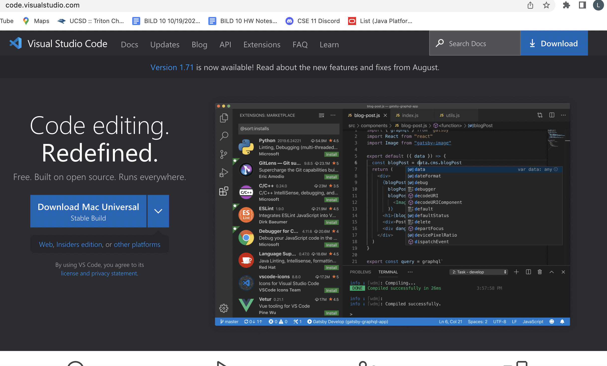
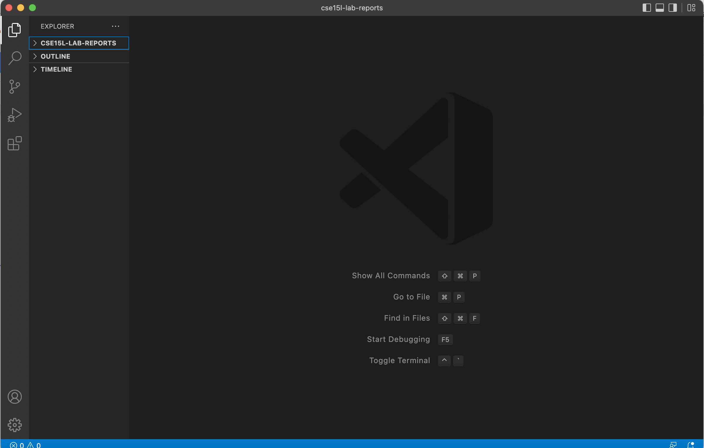
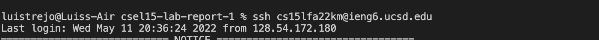
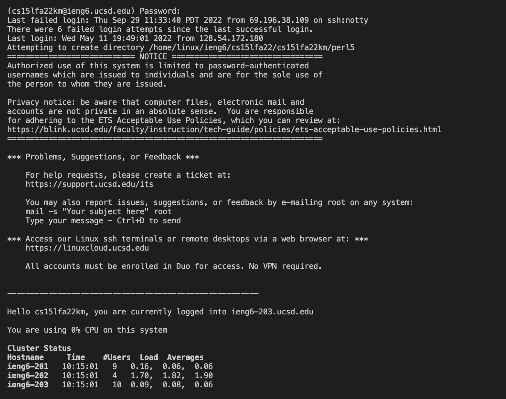
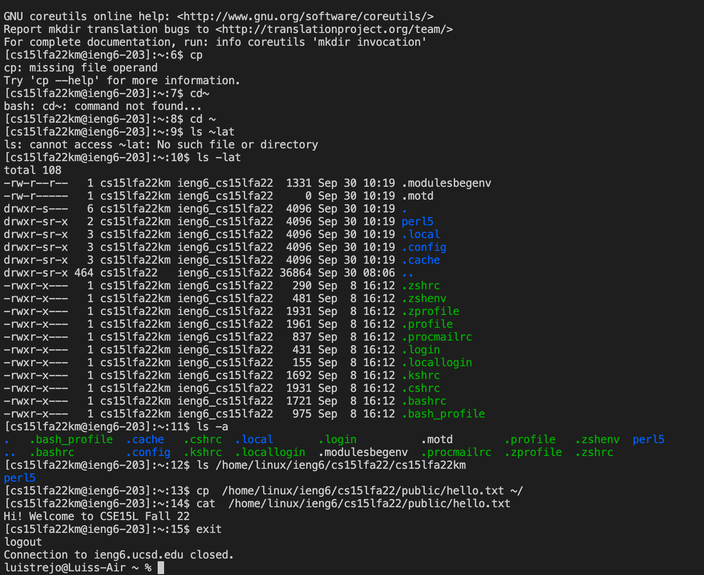
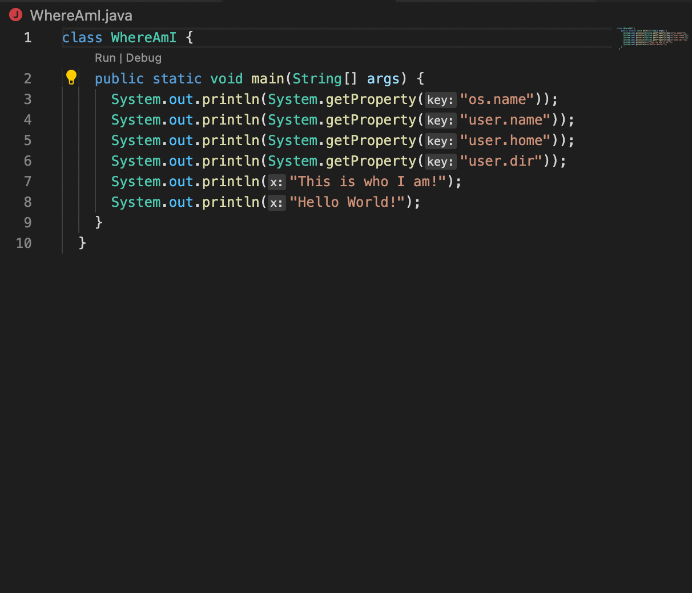
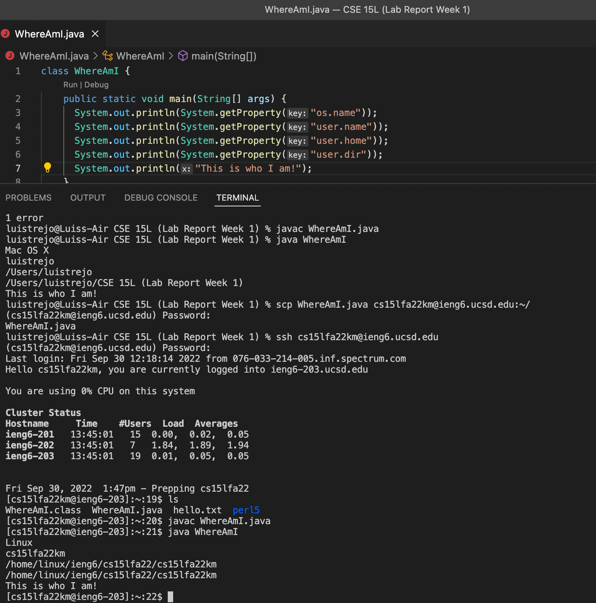
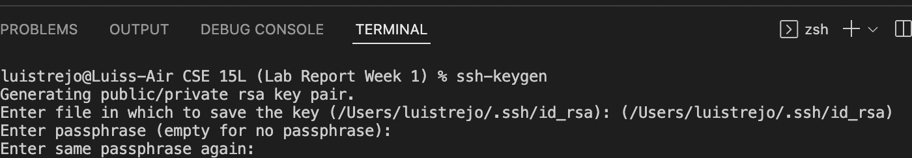
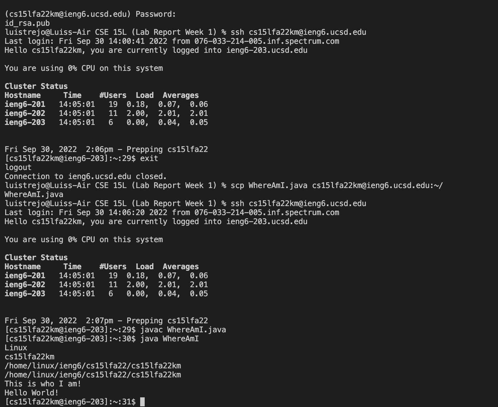
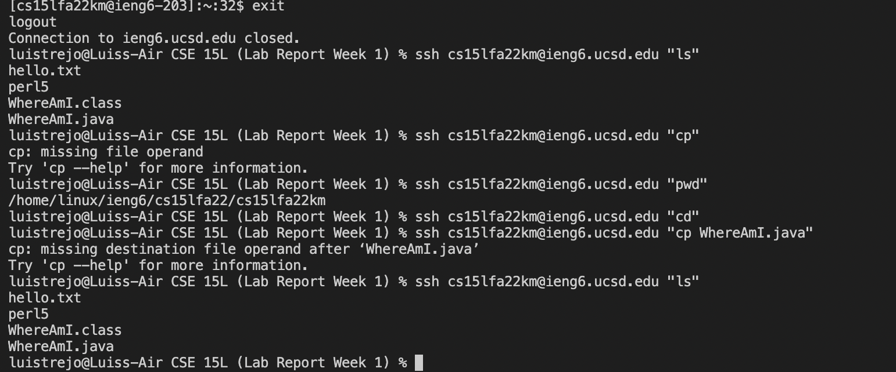

# How to Access Linux and Filesystem with your Mac computer!

### (Lab Report #1) by Luis Trejo

## Step 1: Download VS Code 
* In website called [VSCode](https://code.visualstudio.com/) you will download the program to run/start this assignment
* The website should something like this:

1. First, you want to click Download Mac Universal *(I already have it downloaded)*
2. Also, keep in mind I have a Mac, if you have Windows you have to do other additional procedures.
3. Once you successfully downloaded VSCode you should have a screen like this 

> Keep in mind that my screen background is  black but sometimes it could be white, you can go to settings change the background color.

## Step 2: Remotely Connecting
1. Once you have the VScode open, you want to open up **Terminal** which can be open in the top part of the Mac settings right next to *Window* and *Run*.
2.  Once you have Terminal open, you will have to go to [your CSE 15L](https://sdacs.ucsd.edu/~icc/index.php) via this link. 

*If you already changed your global password, you can skip this step.*

3. Once you change your password, you have to wait around 15 minutes upto to hours (**depends on how many students changed their password, as that can cause some issues with the server.**)
4. Once you got it running you type in the terminal which you will use ` ssh ` + "_"(*Space*) + **username** (e.g cs15lfa22XX) + @ieng6.ucsd.edu.
5. Then you press `Enter` in your keyboard and then it would ask your for your password and you would put in the password that you changed/created from Step 2. 
6. Then you should get something similar to what screenshot below looks like;

> This was after making the ssh key which you will learn more in Step 5. Where password isn't needed.

- What should pop and look for is the message ` Hello cs15lfa22, you are currently logged into ieng6-203.ucsd.edu `
- Once, you get this, you have remotely connected to the linux.

## Step 3: Trying some Commands
- In the linux you can do some unique commands and the command that you should learn is: 
    * cd 
    * ls
    * pwd
    * mkdir
    * cp

..
- Use them in the terminal by just implmenting them. 
- This is how the terminal should be after using these commands.

..
>  As you can see in the screenshot, I am using different commands that are also useful to understand. Some will be errors but that could be because it is missing a part. Is it missing something? Why is there errors? What does the error say? What can I do to make it work? Try it out!!

..

## Step 4. Moving files with `scp`

-  After using the commands above, we need to try somthing out and that is another command that is called `exit`. 
- Exit allows you to logout from the UCSD's servers and linux back to your personal computer data.
- This is very important, as to login back to the linux you need to follow the step #2 and parts 4 to 5. 
- Once you get back to your personal information/ data you need to copy WhereAmI.java
- The code needs to be similar to this

.. 
> Once you have this as a file in your VSCode, we will start to use `scp`

Once we have the java file we will use scp or `secure copy` and way we use is is shown in these steps:

1. First in the terminal you write `scp` + the file in this case (WhereAmI.java)+ username@ieng6.ucsd.edu:~/ 
2. After you enter this in the terminal it will ask you for your password.
3. After entering your password successfully, it will name the file in the terminal, which means you have done it successfully.
4. Login back to the linux/ server and enter javac WhereAmI.java and java WhereAmI you should get something like this.

> You may see that after uing javac and java that it details my os.name and other details the "Hello World" and "This is who I am" are activities that where done in class.

..

## Step 5: Setting SSH Key

- At this point, you might be thinking this is cool, only problem is that I always have to be putting in my password all the time when I login to the server.
- However with `ssh keys` it makes lfe easier and faster to manuver between the local computer (*Your Computer*) and with Linux/Remote shell.
- You create the keys but private and public and with these keys one will be privated in your computer and one can be public to the remote shell. 
- In this case, you follow a similar procedure as scp but with a new commands called `ssh-keygen` and that creates the keys ( **public and private** ).
- What you have to do is create the key and `$ ssh-keygen` 
- Then you have to type in your information like `/users/localusername`
- Then it asks for a passphrase and then ask for it again 
- It should look like this 

> Once you get the passphrase completed it asks for your password one more time, and after that your key should be saved.

- At the end, when you activate your public key to the remote shell, it shows the public key and that means it was successful.
- With this key activated, you just write /username@ieng6.ucsd.edu/ in the terminal and guess what! You don't need your password anymore and even when you implement `scp` you don't need your password for that neither..
- It should appear like this;

> As you can see, password wasn't needed to login anymore!

..

## Step 6: Optimizing Remote Running

- Lastly, once have these steps done, you can actually make running code fast and better optimizing.
- For example, there are ways to make infromation from remote shell pop up in the local computer.

In this instance, it shows some examples that worked and some that didn't.

> In this instance, there are more ways to make remote running easier but these are some of the ways it worked and some errors.

..

//Acknowledgements: I want to acknowledge my group for trying to help out the group that were struggling to get pass Step 2 (including me!). 
